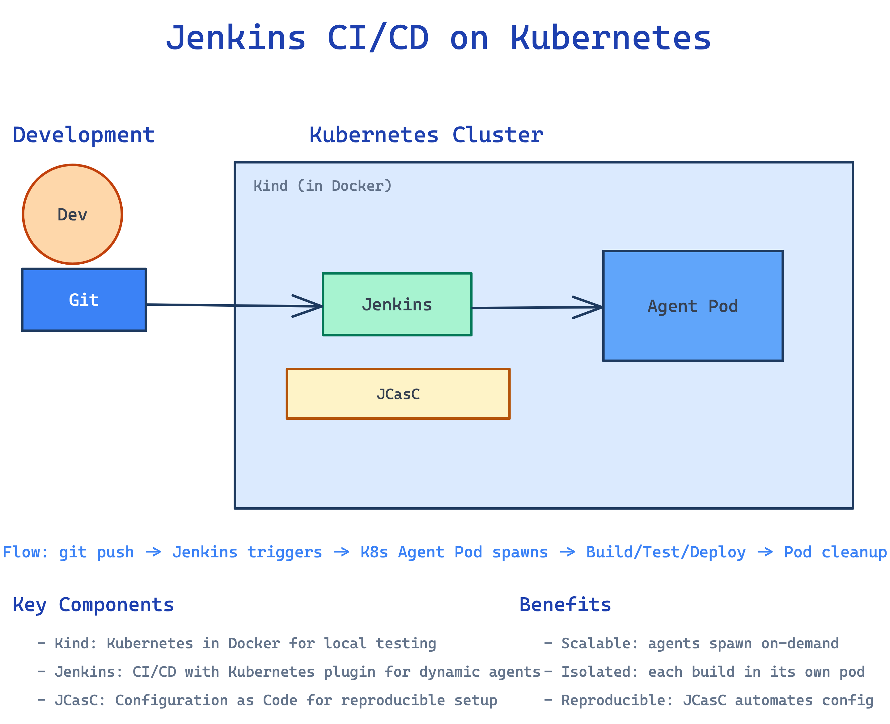

# Jenkins on Kind - CI/CD PoC

Automated Jenkins deployment on Kubernetes in Docker (Kind) for CI/CD testing.

## Quick Start

```bash
# Install everything (Kind cluster + Jenkins)
make install

# Get admin password
make password

# Access Jenkins: http://localhost:8080
# Username: admin
# Password: admin

# Cleanup
make cleanup
```

## Prerequisites

- Docker installed
- Kind installed
- Helm installed
- kubectl installed

## Available Targets

| Target | Description |
|--------|-------------|
| `make install` | Create Kind cluster and install Jenkins |
| `make cluster` | Create Kind cluster only |
| `make jenkins` | Install Jenkins on existing cluster |
| `make password` | Get Jenkins admin password |
| `make cleanup` | Delete Kind cluster |

## Testing Kubernetes Agents

1. Login to Jenkins at http://localhost:8080
2. Create a new Pipeline job
3. Copy contents from `test-pipeline.groovy` into the pipeline script
4. Run the pipeline - a pod should spawn in the `jenkins` namespace

## Architecture



- **Kind**: Single-node Kubernetes cluster running in Docker
- **Jenkins**: Deployed via Helm chart with JCasC configuration
- **Storage**: 8Gi persistent volume for Jenkins data
- **Agents**: Dynamic Kubernetes pods spawned via Jenkins Kubernetes plugin

## Files

```
.
├── Makefile                  # Main entry point
├── kind/cluster-config.yaml # Kind cluster configuration
├── jenkins/
│   ├── helm-values.yaml     # Jenkins Helm values
│   └── jcasc.yaml          # JCasC reference config
└── test-pipeline.groovy    # Test pipeline for K8s agents
```
